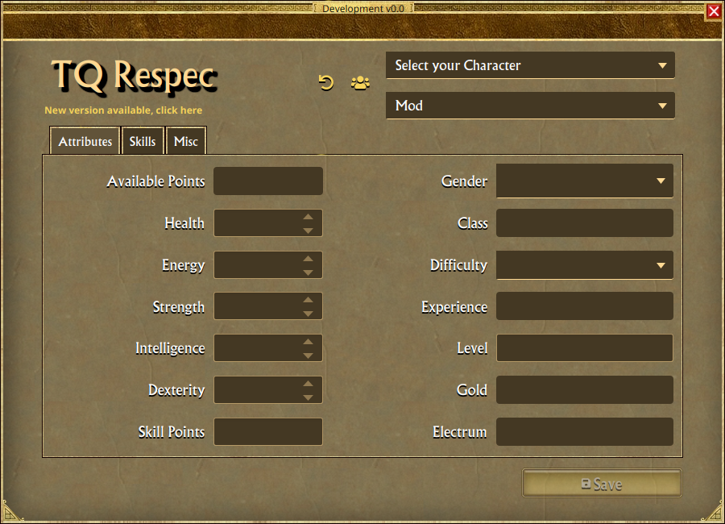

# TQ Respec

## Introduction

TQRespec is a tool for [Titan Quest](https://titanquestgame.com) game that helps you to change your character at any time.
You can download TQRespec from the releases page, [here](https://github.com/epinter/tqrespec/releases/latest). There's no installation, just
extract and run.

**For a brief documentation about MAP, ARC, ARZ, textures and resources extraction, see [tq-extract](https://github.com/epinter/tqrespec/tree/master/src/main/java/dev/pinter/tqextract) command line tool included with TQRespec.**

#### ***Requirements***

This software runs on Windows or Linux, both must be 64bit. You don't need to have Java or any other software installed,
but if you have problems like missing dlls, check
if [Microsoft Visual C++ Redistributable](https://docs.microsoft.com/en-us/cpp/windows/latest-supported-vc-redist) is updated.

## **How to use**

#### ***Before you start***

Keep in mind that this software make modifications to your save game (more specifically the file Player.chr).
You shouldn't modify your characters while the game is running, this can corrupt your save game.
***YOU SHOULD ALWAYS KEEP A FULL BACKUP OF YOUR SAVE GAME FOLDER*** (Documents/My Games/Titan Quest - Immortal Throne).

#### ***Screenshots***

#### ***Running without the game installed***

This application uses game data. If you want to run it on a PC that doesn't have the game installed,
make sure you have a 'gamedata' directory with Database and Text resources inside it. The structure should look like this:

~~~
TQRespec/app
TQRespec/runtime
TQRespec/TQRespec.exe
TQRespec/gamedata/Database/database.arz
TQRespec/gamedata/Text/Text_BR.arc
TQRespec/gamedata/Text/Text_CH.arc
TQRespec/gamedata/Text/Text_CZ.arc
TQRespec/gamedata/Text/Text_DE.arc
TQRespec/gamedata/Text/Text_EN.arc
TQRespec/gamedata/Text/Text_ES.arc
TQRespec/gamedata/Text/Text_FR.arc
TQRespec/gamedata/Text/Text_IT.arc
TQRespec/gamedata/Text/Text_JA.arc
TQRespec/gamedata/Text/Text_KO.arc
TQRespec/gamedata/Text/Text_PL.arc
TQRespec/gamedata/Text/Text_RU.arc
TQRespec/gamedata/Text/Text_UK.arc
~~~

Database and Text folders (with its contents) are copied from the game.
The savegame needs to be at the same location as the game uses (Documents/My Games/...).

#### ***Use it!***

Select the character you want to change. Now you can see some information like Class and Difficulty, and start to change your savegame.

#### ***Mod support***

When a mod is selected, the database from the mod is loaded over the game's database. So skills, text, attribute points modifier and skill points modifier
overrides the game. The portals are not loaded from the mod, they are hard-coded.

#### ***Attributes***

There are five attributes available to change (Health, Energy, Strength, Intelligence, Dexterity). When you decrease an attribute,
you will see the number in "Available Points" increasing, and when you increase an attribute the points are automatically got
from "Available Points". The number that increases in each of the attribute fields follows in game rules.

#### ***Skills***

Now if you change to Skills tab, you will see two lists with the skills of your character. Below these lists, there are two buttons for
each.
The first button "Reclaim All Skills Points" will remove all points allocated on skills on that mastery and make the points available to
use in game. The button "Mastery" permits you to reduce the mastery level to 1 or remove the mastery completely.

If you have a mastery on level 24 and 7 skills with points allocated, you can click on "Reclaim All Skills Points" to have the points from
the 7 skills back to you. Then you click on "Mastery / Reclaim" to have 23 points back from the mastery, so you will have the mastery with
just 1 point allocated, or you can click on "Mastery / Remove" to have all 24 points from mastery.

#### ***Characters list and stats***

When you click on the button near the character selection list, you will be able to see a table with all your characters, with attributes
and stats. There's also an option to export the table to CSV. To Archive or Unarchive a character, right click on the row and select the
option desired. When the archive is done, the character directory is moved from "SaveData/Main/_charactername" to
"SaveData/Main/ArchivedCharacters/_charactername", hiding it from the game. Unarchive moves the character back to default directory.

#### ***Android support***

Characters from "Titan Quest: Legendary Edition" are supported. TQRespec is unable to access the savegames directly on mobile, so you will
always have to copy from mobile and copy again to device when finished. The savegame directory can be copied from Android device to savedata
directory in the same directory as TQRespec.exe, the structure is like this:

~~~
TQRespec/app
TQRespec/runtime
TQRespec/savedata/__save1
TQRespec/savedata/_CharacterFromWindowsVersion
TQRespec/TQRespec.exe
~~~

The characters are normally stored at Android/data/com.hg.titanquestedition/files/Preferences/SaveData/Main. The name of each savegame
is "__save" and followed by a number, this number is the saveId. Please don't ask about savegame access on mobile phones, there's nothing
that can be done on TQRespec. The security features being implemented in mobile operating systems are limiting user access more than before.

***IMPORTANT***: The game files (database and text) are ALWAYS needed. See above "Running without the game installed" to know where to copy
the files. At this moment, the Android version is compatible with PC version. While (AT THIS MOMENT) there's no problem using a database
from one platform on a savegame from another, we don't know when the compatibility will break. So is recommended to use Android
database/text with Android savegame, and Windows database/text with Windows savegame. TQRespec will not block using PC files with mobile
savegame, but will alert. And will block the usage of mobile database with PC savegames. After the release of Eternal Embers on PC and not
on mobile, the character's copy will still work, but if you copy a character with skills from Eternal Embers the result is uncertain.
The stash (additional storage) will not be supported, conversion and copy of mobile savegames completely ignores the stash. All items
stored in the character are kept.

The old mobile version of the game will not be supported.

#### ***IOS support***

Users of the IOS version of the game reported it works like Android. The savegame is located in TitanQuest, inside iCloud.

#### ***Copy your character***

If you want to change the name of you character, in the Misc tab you can type the new name in the "New character" text field, select the
target platform then click on "Copy" button. A new character will be created, with progress, inventory with all items, attributes, skills,
etc...

There are three targets available for selection: Windows, Android and Backup:

* The Windows target will make the new savegame compatible with Windows version of TQ, converting if necessary (when you are copying a
  mobile savegame to windows).
* The Android target will make a zip file with the savegame prepared to run on Android device, converted if necessary. Differently from
  Windows version, the savegame directory is different from player name inside the game. TQRespec generates a random number for the save-id,
  although very unlikely it's not impossible a save-id generated is already present on your device, if this happens you can just copy again.
  Some data is not copied, see "Android Support" for details.
* The Backup target will make a zip file with the savegame. If you type a new name, it will be renamed before save. In the case of a mobile
  savegame, the save-id will be changed before save too.

#### ***Saving and backup***

After you finish, you can click on Save. At this moment, TQRespec will make a backup of the file "Player.chr" inside a .zip in the folder
"Titan Quest - Immortal Throne/SaveData/TQRespec Backup". The file "Player.chr" is where the games saves everything about the character,
except the progress, transfer area and storage.

#### ***Multi-language support***

All the languages available in-game are supported. Some interface strings can't be reused, so you will see some strings in your language
and others in english if nobody contributed with a translation for your language. See [Translators](#translators) for a list of languages.

#### ***Building***

Before building it, you need to have OpenJFX(JavaFX) SDK inside the ./sdk subdirectory. A repository with the needed files can be
found [here](https://github.com/epinter/openjfx-sdk). Just clone it inside sdk directory. With JDK installed, you can build executing the '
appimage' gradle task:

~~~
./gradlew appimage
~~~

## **Troubleshooting**

#### ***Startup***

This software can fail to start if the game is not detected. Game is detected searching for Uninstall information from Windows, and data
from your Steam installation. If you can't start, get the error message inside the "Show details" and open an issue. Or maybe you can find
some help in the discussion at Steam Guides.
If your game path is not detected, you still can run TQRespec copying the game data, to do so follow the
instructions [Running without the game installed](https://github.com/epinter/tqrespec#running-without-the-game-installed).

TQRespec uses the Java Preferences API to store the last detected game path. If you have problem to launch TQRespec, you can try to delete
everything inside this key of Windows registry: **"Computer\HKEY_CURRENT_USER\SOFTWARE\JavaSoft\Prefs\br\com\pinter\tqrespec"**, be very
careful when dealing with the registry.

#### ***Errors and reporting***

If you see an error popup while using TQRespec, click on "Show details" and copy the complete error message (called java Exception). With
this exception, a developer can find exactly where the code failed. If the software is crashing and you don't get an error message, or is
crashing during startup, go to Windows Explorer and find the log file called **tqrespec.log** inside the directory %TEMP%. The %TEMP% is the
windows temporary directory for you user.

#### ***Debug log***

If you need debug logs, you need to run the application with command line parameters:
The number is the level of debugging, from 1 to 9:

Lower level of debugging messages sent to log:

~~~
TQRespec.exe --debug=1
~~~ 

More debug for GUI and player save parsing, and basic level for database parsing:

~~~
TQRespec.exe --debug=3
~~~ 

Higher level of debug for GUI, player save and database parsing.

~~~
TQRespec.exe --debug=5
~~~ 

Higher level of debug for the application and all libraries:

~~~
TQRespec.exe --debug=9
~~~ 

## **Contribution**

### ***Translators***

* Brazilian Portuguese (pt-BR): ***Emerson Pinter***
* Russian (ru): ***Evgeniy Chefranov (titanquest.org.ua)***
* Ukrainian (uk): ***Evgeniy Chefranov (titanquest.org.ua)***
* Italian (it): ***Loris Gabriele***
* French (fr): ***Etienne Lamoureux***

## **Thanks**

### ***THQ and [Iron Lore](https://en.wikipedia.org/wiki/Iron_Lore_Entertainment) for creation of this game that we love since 2006,
and [THQ Nordic](https://www.thqnordic.com) for all the content and improvements***